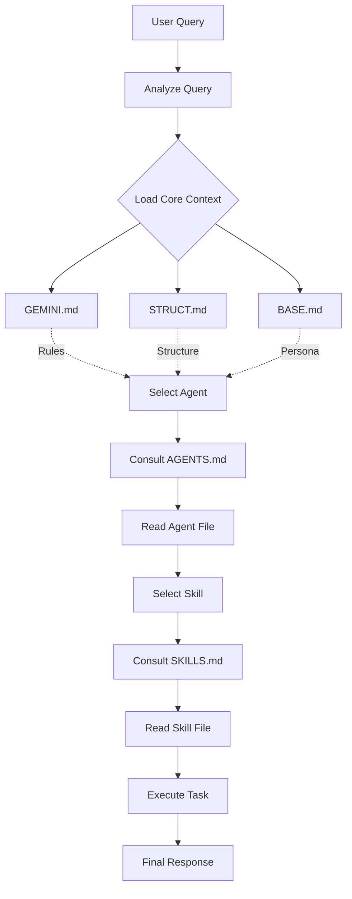

# AgentKit Architecture

> **Purpose:** Intelligent Support System for VietRecruit

---

## Sequential Agent Flow

AgentKit operates on a strict **Sequential Context & Routing Protocol** to ensure maximum context relevance, constraint adherence, and token efficiency.



### Flow Components

1.  **Analyze Query**: The system first determines the core intent (e.g., "Fix a bug", "Design an API") and constraints.
2.  **Load Core Context**:
    *   **`GEMINI.md`**: The rulebook. Enforces this very protocol.
    *   **`STRUCT.md`**: The map. Provides the directory structure and codebase context of VietRecruit.
    *   **`BASE.md`**: The identity. Defines the "Lead Software Engineer" persona and communication style.
3.  **Select Agent**:
    *   **`AGENTS.md`**: The directory. A categorized index of all 20+ specialized agents.
    *   **Agent File**: The persona. Loads the specific expertise (e.g., `backend-specialist.md`).
4.  **Select Skill**:
    *   **`SKILLS.md`**: The library. A categorized index of knowledge modules.
    *   **Skill File**: The knowledge. Loads specific patterns and best practices (e.g., `api-patterns/SKILL.md`).
5.  **Execute**: The task is performed using this precisely constructed stack of context.

---

## Directory Structure

```plaintext
.agent/
├── agents/                  # Specialist Agents
│   ├── AGENTS.md            # Agent Index
│   └── *.md                 # Agent Definitions
├── skills/                  # Knowledge Domains
│   ├── SKILLS.md            # Skill Index
│   └── [skill-name]/        # Skill Modules
├── rules/                   # Core Protocols
│   └── GEMINI.md            # Execution Rules
├── workflows/               # Automation
├── ARCHITECTURE.md          # This File
└── README.md                # Project Overview
```

## 🛠️ Key Components

### Agents
Specialized personas that act as the "actor" for a task.
*   **Orchestrator**: Manages multi-step complex tasks.
*   **Backend Specialist**: Implementation of APIs and logic.
*   **DevOps Engineer**: Infrastructure and deployment.
*   *(See `agents/AGENTS.md` for full list)*

### Skills
Modular knowledge bases that provide the "know-how".
*   **api-patterns**: REST/GraphQL standards.
*   **database-design**: Schema optimization.
*   *(See `skills/SKILLS.md` for full list)*

---
