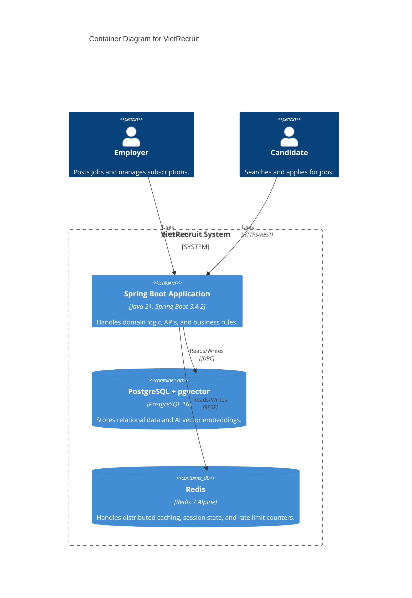

# System Overview

## Containter Level Architecture

This diagram illustrates the core containers defined in the `infra/` directory and their interactions with the application.

## Infrastructure Components

- **vr-postgres:** Primary relational database holding domain entities.
- **vr-redis:** Primary ephemeral store for circuit breakers, rate limiters, and system performance optimizations.
