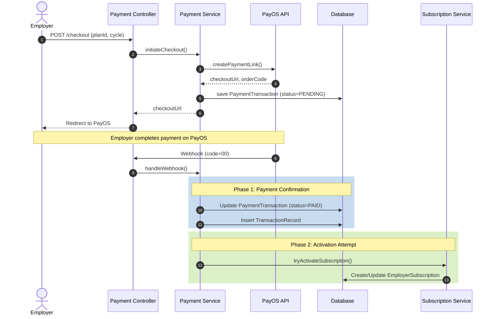

# Payment Module Architecture

## Overview

The VietRecruit Payment Module handles employer subscription purchases, payment gateway integration (PayOS), transaction history tracking, and failure recovery. This document explains the system architecture, the two-phase transaction model, and the resilience patterns used to ensure data consistency between payments and subscriptions.

## Prerequisites

- You must understand the subscription plan structures and billing cycles.
- You must be familiar with the PayOS webhook integration principles.

## Core Domain Models

The module relies on three primary models:

- `PaymentTransaction`: Tracks the lifecycle of a single checkout attempt (e.g., PENDING, PAID, CANCELLED).
- `TransactionRecord`: An immutable ledger entry created only upon successful payment confirmation.
- `EmployerSubscription`: The actual service entitlement granted to the company.

## Payment Flow Architecture

The checkout process uses a two-phase transaction model to cleanly separate payment tracking from subscription activation. This ensures that even if subscription activation fails, the payment status remains strongly consistent with the payment gateway.

## Resilience and Error Handling

The module implements strict resilience patterns to handle concurrent requests, external API failures, and distributed system inconsistencies.

### Concurrency and Idempotency

- **Concurrent Checkouts**: The system applies a unique partial index on `PaymentTransaction`. If a user rapidly double-clicks the checkout button, the database enforces a constraint preventing multiple active `PENDING` transactions for the same company. The service catches the constraint violation and returns a `PAYMENT_ALREADY_PENDING` error.
- **Webhook Idempotency**: Webhooks from PayOS can arrive multiple times. The `handleWebhook` method first checks the local `PaymentTransaction` status. If the status is no longer `PENDING`, the handler immediately returns, ignoring duplicate webhooks.

### Payment Gateway Failures

External calls to the PayOS API are wrapped in a Resilience4j Circuit Breaker (`@CircuitBreaker(name = "payosPayment")`).
If the PayOS API experiences high latency or downtime, the circuit opens. The service automatically executes the `checkoutFallback` method, throwing an API exception indicating the payment service is temporarily unavailable, rather than waiting for timeouts.

### Two-Phase Commit and Recovery

Subscription activation is fragile (e.g., database locks, email notification failures). To prevent losing payment records, the webhook handler uses dual transactions:

1.  **Transaction 1 (Primary)**: Confirms the payment payload, updates the `PaymentTransaction` to `PAID`, and persists the `TransactionRecord`. This transaction always commits if the webhook is valid.
2.  **Transaction 2 (Propagation.REQUIRES_NEW)**: Attempts to activate the subscription via `SubscriptionService.activateSubscription`.

If Transaction 2 fails, the overarching webhook handler logs the error but does **not** roll back Transaction 1. The user's payment is safely recorded as `PAID`.

#### Automated Recovery Mechanisms

Two scheduled batch jobs run in the background to automatically reconcile state anomalies:

- `PaymentReconciliationTask`: Runs periodically. It queries the PayOS API for any local `PENDING` transactions older than 15 minutes. If PayOS reports the link was paid, it artificially triggers the webhook logic to process the missing payment. It also cancels stale link data.
- `PaymentExpiryTask`: Runs periodically to sweep local `PENDING` transactions that have surpassed the predefined expiration window and marks them as `EXPIRED`, cleaning up the database.

If a payment is marked `PAID` but the subscription was not activated (due to a Transaction 2 failure), the front-end or a manual admin action can call `activateAfterPayment(orderCode)`. This endpoint safely retries the activation logic because the payment is already verified and confirmed.
