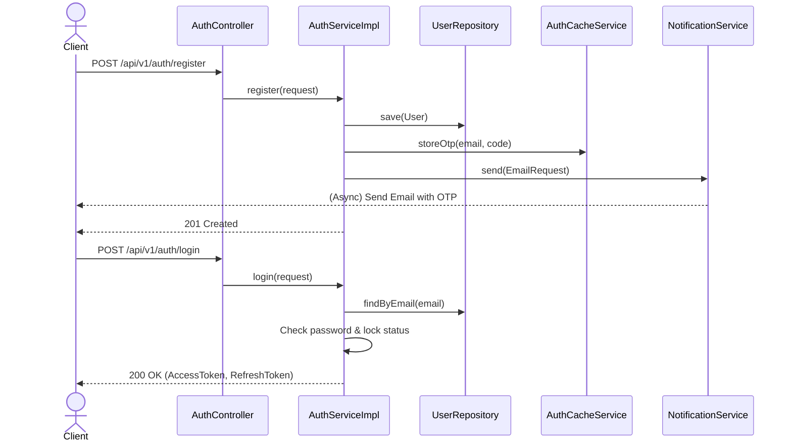

# Authentication & Authorization

## Overview

The Auth module provides secure authentication (Standard JWT & OAuth2), role-based access control, OTP-based email verification, and brute-force protection mechanisms.

## Architecture

- **AuthController**: Exposes endpoints for login, registration, password reset, and OTP verification. Extends `BaseController`.
- **AuthServiceImpl**: Implements core authentication logic, token generation, user locking, and delegates email triggers to the Notification module.
- **JwtService**: Handles JWT creation, parsing, and validation.
- **AuthCacheService**: Manages OTP caching, brute-force counters, and token blacklisting using Redis.

## Flow

1.  **Registration & Verification**: Users register and receive an OTP via email. They must verify the 8-digit OTP to activate the account.
2.  **Login**: Users authenticate with credentials or OAuth2. A successful login returns an Access Token (JWT) and a Refresh Token.
3.  **Brute Force Protection**: Exceeding `MAX_FAILED_ATTEMPTS` (5) locks the account for 30 minutes.

## Sequence Diagram

## Database Schema

- **users**: Core entity holding `email`, `password_hash`, `failed_attempts`, `is_locked`, `lock_until`, and `email_verified`.
- **user_auth_providers**: Maps external OAuth2 identities (Google, GitHub) to internal users.
- **refresh_tokens**: Stores hashed refresh tokens with expiration and revocation flags.

## Configuration & Resilience

Endpoints are strictly protected against abuse using Resilience4j rate limiters defined in `resilience4j-prod.yml`.

- **`authStrict`**: Applies to `/login`, `/register`, `/forgot-password`. Limits to 10 requests / 60s.
- **`authModerate`**: Applies to `/refresh`, `/logout`. Limits to 20 requests / 60s.
- **`otpSend`**: Applies to `/resend-otp`. Limits to 3 requests / 300s.
- **`otpVerify`**: Applies to `/verify-otp`. Limits to 10 requests / 60s.
