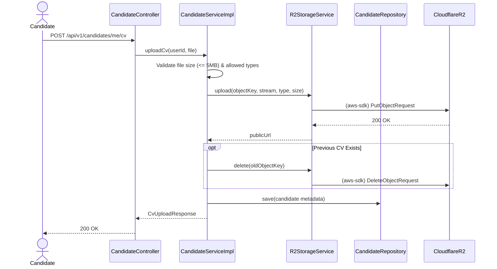

# Candidate Module

## Overview

This document provides an architectural and behavioral explanation of the Candidate module within the VietRecruit system. The module handles candidate profiles, resume (CV) storage integrations, and metadata preparation for job matching functionalities.

## Architecture

- **CandidateController**: Exposes endpoints for authenticated candidates to retrieve and update their profiles, as well as fetch candidate details for authorized HR/Admin personnel. Extends `BaseController`.
- **CandidateServiceImpl**: Implements business logic for managing candidate data. Orchestrates profile updates and manages CV file uploads through the internal `StorageService` abstraction.
- **R2StorageServiceImpl**: A concrete implementation of `StorageService` that integrates with Cloudflare R2 (AWS S3-compatible API) to persist CV documents securely.

## Flow & Lifecycle

1. **Auto-Provisioning**: The system does not expose a direct `/candidates` creation endpoint for users. Instead, a `Candidate` entity is automatically provisioned via an internal hook immediately after a successful `User` registration or OAuth2 signup process in the Auth module.
2. **Profile Enrichment**: Candidates can update their profiles (e.g., summary, desired salary, skills, education) via the `PUT /candidates/me` endpoint. Fields such as `desiredPosition`, `skills`, and `workType` serve as foundational attributes for candidate-job matching.
3. **CV Uploads & Storage**:
   - Candidates can upload a single primary CV (PDF, DOCX, JPEG, PNG, up to 5MB).
   - The document is validated and sanitized before being streamed to Cloudflare R2.
   - Upon a successful upload, the public R2 URL and file metadata (sizes, types, original filename) are recorded in the candidate's profile.
   - Uploading a new CV automatically deletes the previous object from the R2 bucket to prevent storage bloat.

## Sequence Diagram: CV Upload Flow

## Resilience & Storage

- **Circuit Breaker (`r2Storage`)**: The CV upload and delete operations are wrapped in Resilience4j circuit breakers. If Cloudflare R2 is unreachable, the API falls back safely (e.g., throwing a `STORAGE_UNAVAILABLE` error without corrupting the database state).
- **Sanitization**: All uploaded filenames are stripped of potentially malicious path-traversal strings and special characters prior to being used as S3 Object Keys.
- **Rate Limiting**: Sits behind a `mediumTraffic` rate limiter to prevent excessive CV uploads or abuse per client IP.
