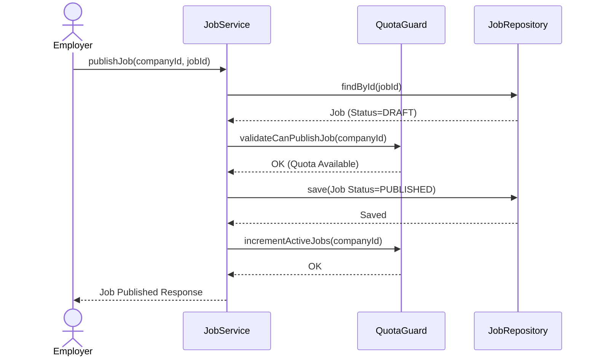

# Job Lifecycle

## Overview

Jobs transition through a strictly ordered sequence of states (`DRAFT` > `PUBLISHED` > `CLOSED`) to ensure consistency and enforce employer subscription limits prior to public visibility.

## Flow

- **Creation:** Jobs are initialized as `DRAFT` via `createJob`. No quota checks apply.
- **Validation & Publication:** Transitioning to `PUBLISHED` triggers the `QuotaGuard` to verify active subscription limits.
- **Closure:** Transitioning to `CLOSED` releases the quota, allowing the employer to publish new jobs.

## Sequence Diagram



## Key Code

The `JobServiceImpl` coordinates state transitions and delegates subscription rule enforcement to the `QuotaGuard`.

```java
@Override
@Transactional
public Job publishJob(UUID companyId, UUID jobId) {
    var job = findJobByIdAndCompany(companyId, jobId);

    if (job.getStatus() != JobStatus.DRAFT) {
        throw new ApiException(ApiErrorCode.BAD_REQUEST, "Only DRAFT jobs can be published");
    }

    // Validate subscription and quota before publishing
    quotaGuard.validateCanPublishJob(companyId);

    job.setStatus(JobStatus.PUBLISHED);
    var saved = jobRepository.save(job);

    // Increment active job count after successful save
    quotaGuard.incrementActiveJobs(companyId);

    log.info("Published job id={} company={}", jobId, companyId);
    return saved;
}
```
