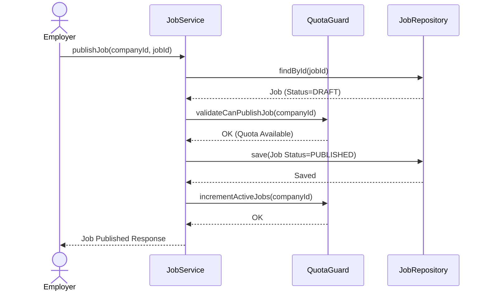

# Job Management

## Overview

The Job module manages the lifecycle of employment listings (`DRAFT`, `PUBLISHED`, `CLOSED`), applying strict validations and quotas to employers before public visibility.

## Architecture

- **JobController**: Provides endpoints for job creation, status transitions, and retrieval.
- **JobServiceImpl**: Handles business logic for mutating the `Job` entity and managing state relationships.
- **JobRepository**: Executes CRUD operations against the `jobs` database table.
- **QuotaGuard (Subscription Module)**: A dependency invoked by the `JobService` to enforce active subscription limits during publication.

## Flow

1.  **Creation**: Employers initialize a job in the `DRAFT` state via `createJob`. This action incurs no quota penalties.
2.  **Validation & Publication**: Transitioning to `PUBLISHED` triggers the `QuotaGuard` to verify active subscription limits and capacity. If successful, the job's public status is updated and the quota counter increments.
3.  **Closure**: Transitioning to `CLOSED` releases the allocated quota slot, allowing the employer to publish subsequent jobs.

## Sequence Diagram

## Database Schema

- **jobs**: Core entity holding `company_id`, `title`, `description`, and `status`. The `status` enum maps to `DRAFT`, `PUBLISHED`, and `CLOSED`.

## Configuration & Resilience

Job endpoints execute within strictly governed rate limits to mitigate spam and automated scraping.

- **`lowTraffic`**: Applies to heavy mutation endpoints (publish/close/create) to prevent programmatic flooding. Limiting 5 requests / 30s.
- **`highTraffic`**: Applies to read-heavy endpoints (listing active jobs). Limits to 25 requests / 30s.
