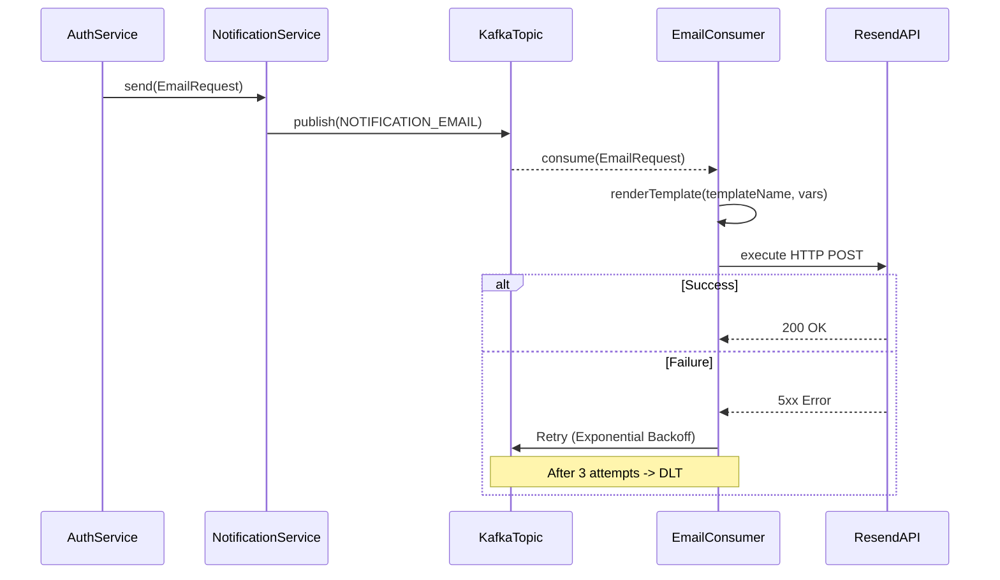

# Job Notifications & Delivery

## Overview

The Notification module provides asynchronous, reliable delivery of transactional emails (e.g., OTP verification, password resets) using Kafka and the Resend API.

## Architecture

- **NotificationServiceImpl**: Acts as the Kafka producer, pushing `EmailRequest` payloads to the designated topic.
- **EmailConsumer**: Acts as the Kafka listener, processing messages with exponential backoff and DLT (Dead Letter Topic) routing.
- **EmailTemplateResolver**: Resolves and renders HTML email templates using contextual variables.
- **ResendEmailClient**: The external HTTP client that interfaces with the Resend API for actual transmission.

## Flow

1.  **Event Generation**: A feature module (e.g., Auth) calls `NotificationService.send()`.
2.  **Streaming**: The request is serialized and published to the `notification.email` Kafka topic.
3.  **Consumption**: The `EmailConsumer` picks up the record, renders the template, and invokes the Resend API.
4.  **Resilience**: Failures trigger automatic retries. Exhausted retries drop the message into a DLT for manual review.

## Sequence Diagram



## Database Schema

Currently, the Notification module relies entirely on Kafka for state persistence during the delivery lifecycle. No dedicated database tables are utilized.

## Configuration & Resilience

- **RetryableTopic**: Configured for 3 attempts with a 2-second delay and a `2.0` multiplier.
- **Resend API Circuit Breaker**: The `resendApi` instance isolates failures in the external provider.

```yaml
resilience4j:
    circuitbreaker:
        instances:
            resendApi:
                slidingWindowSize: 20
                minimumNumberOfCalls: 10
                waitDurationInOpenState: 30s
                failureRateThreshold: 50
```
