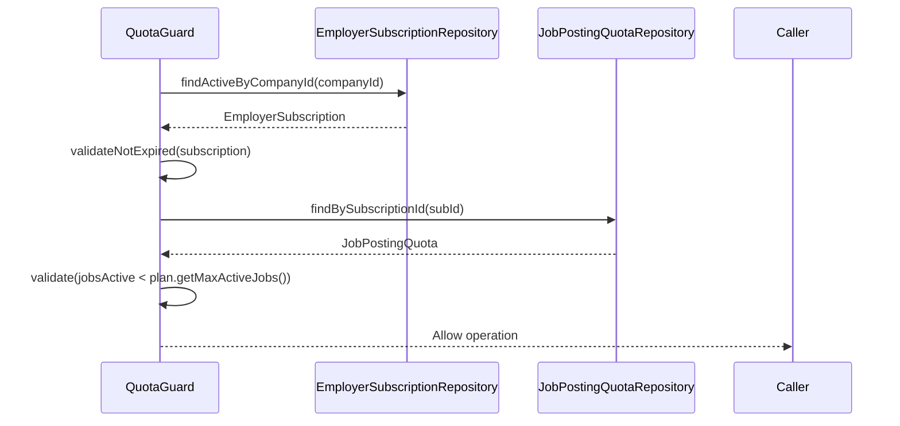

# Quota Management

## Overview

Employer job posting concurrency is limited strictly by their active `SubscriptionPlan` to prevent resource abuse and drive revenue logic.

## Flow

- **Validation:** System checks `EmployerSubscription` validity and capacity before authorizing a new `PUBLISHED` job.
- **Utilization Tracking:** The `JobPostingQuota` record holds real-time counters representing active application listings.
- **Unlimited Plans:** Handled explicitly if `plan.getMaxActiveJobs() == -1`.

## Sequence Diagram



## Key Code

The `QuotaGuard` component ensures a centralized mechanism for blocking operations when limits are breached.

```java
private void validateQuotaAvailable(EmployerSubscription subscription) {
    var plan = subscription.getPlan();
    if (plan.getMaxActiveJobs() == -1) {
        return; // unlimited
    }

    var quota = getQuota(subscription);
    if (quota.getJobsActive() >= plan.getMaxActiveJobs()) {
        throw new ApiException(
                ApiErrorCode.QUOTA_EXCEEDED,
                String.format(
                        "Active job limit reached (%d/%d). Upgrade your plan for more.",
                        quota.getJobsActive(), plan.getMaxActiveJobs()));
    }
}
```
