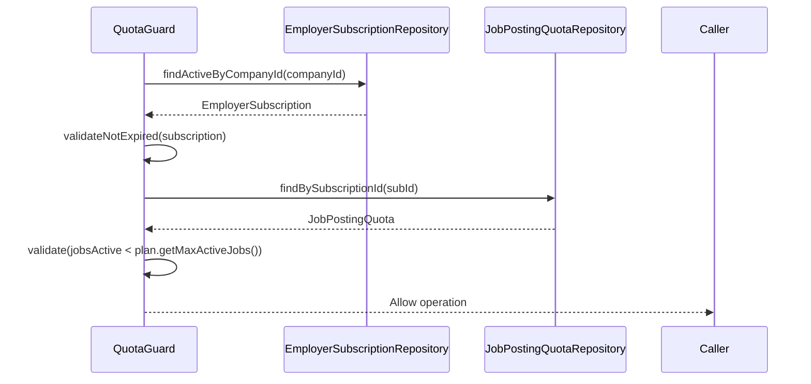

# Subscription & Quota Management

## Overview

The Subscription module defines employer tier limits (`SubscriptionPlan`), manages active billing cycles (`EmployerSubscription`), and strictly enforces posting concurrency (`JobPostingQuota`).

## Architecture

- **SubscriptionController**: Exposes endpoints for purchasing or upgrading subscriptions.
- **PlanController**: Exposes endpoints for retrieving available platform subscription tiers.
- **SubscriptionServiceImpl**: Provisions new subscriptions and manages expirations.
- **QuotaGuard**: An injectable service component that evaluates state constraints to block unauthorized actions globally (e.g., job publication).
- **SubscriptionExpiryTask**: A scheduled `@Scheduled` job that evaluates and archives expired subscriptions periodically.

## Flow

1.  **Provisioning**: A user upgrades their plan. `SubscriptionService` deactivates the prior subscription, allocates a new `EmployerSubscription`, and initializes a fresh `JobPostingQuota`.
2.  **Validation Check**: Prior to resource consumption (e.g., publishing a job), external modules call `QuotaGuard.validateCanPublishJob()`. This function evaluates `expiresAt` and current usage versus `maxActiveJobs`.
3.  **Utilization Tracking**: Real-time interaction forces the `QuotaGuard` to increment or decrement `jobs_active` counters inside the `JobPostingQuota` record.
4.  **Expiration Handling**: Expired plans automatically fail validation checks. Scheduled tasks clear dead subscriptions to optimize active queries.

## Sequence Diagram

## Database Schema

- **subscription_plans**: Defines the static product tiers (`code`, `name`, `price`, `max_active_jobs`). A value of `-1` represents unlimited quota.
- **employer_subscriptions**: Joins a `company_id` to a `plan_id`, holding the `status` (ACTIVE/EXPIRED) and boundary timestamps (`starts_at`, `expires_at`).
- **job_posting_quotas**: Tracks real-time consumption (`jobs_active`, `jobs_posted`) tied to the active subscription ID.

## Configuration & Resilience

To prevent race conditions during rapid quota consumption, pessimistic or optimistic locking may be applied at the database tier on the `JobPostingQuota` table, though currently synchronized via atomic transactional guarantees in `QuotaGuard`.

- **`lowTraffic`**: Subscription transitions and purchases are constrained severely to 5 requests / 30s.
