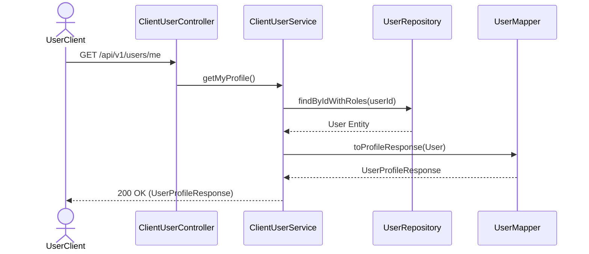

# Candidate and Employer Profiles

## Overview

The User module manages profile data, role assignment, and permissions for both Candidates and Employers across the platform.

## Architecture

- **ClientUserController**: Exposes public or user-specific endpoints for profile retrieval and updates.
- **AdminUserController**: Exposes elevated endpoints for user management and administration.
- **ClientUserServiceImpl**: Handles business logic for fetching and updating user profiles.
- **UserMapper**: Uses MapStruct to map the `User` entity to `UserProfileResponse` or `AdminUserResponse`.

## Flow

1.  **Profile Retrieval**: A user fetches their profile. The service retrieves the `User` entity and roles.
2.  **Profile Update**: A user submits an `UpdateProfileRequest`. The system maps the updates, ignoring protected fields (like `id`, `companyId`, `password_hash`), and persists the changes.

## Sequence Diagram

## Database Schema

- **users**: Contains profile information (`full_name`, `phone`, `avatar_url`, `linkedin_url`, `location`, `dob`, `gender`).
- **roles**: Predefined roles (e.g., `CANDIDATE`, `EMPLOYER`, `ADMIN`).
- **permissions**: Fine-grained access control nodes.
- **user_roles** / **role_permissions**: Join tables establishing the Many-to-Many RBAC relationships.

## Configuration & Resilience

Profile updates and retrievals enforce moderate-to-low traffic rate limits to prevent data scraping or rapid mutation.

- **`lowTraffic`**: Applies to high-cost updates (e.g., resume/avatar uploads). Limits to 5 requests / 30s.
- **`mediumTraffic`**: Applies to standard profile reads. Limits to 15 requests / 30s.
