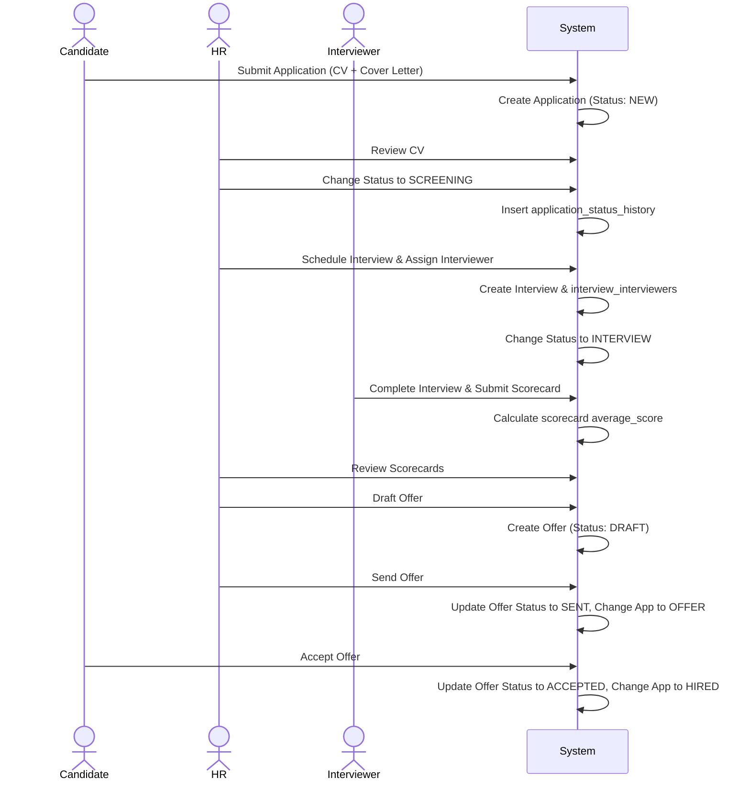
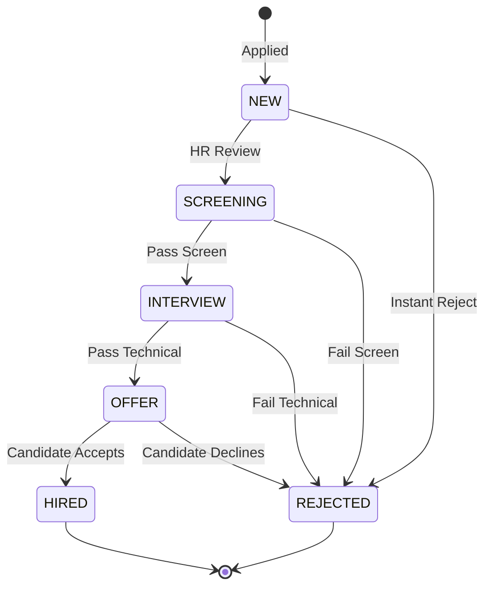

# Feature: APPLICANT_TRACKING

## Overview
This feature governs the lifecycle of candidates applying to job postings. It manages everything from the initial resume submission, tracking state changes across the recruiting pipeline, scheduling and executing interviews using structured scorecards, to issuing final job offers.

## Involved Tables
- **applications**: Links a candidate to a job, tracking the overarching status and the specific artifact (CV) used for this application.
- **application_status_history**: An append-only audit log tracking who changed an application's status, when, and with what transitional notes.
- **interviews**: Tracks scheduled assessments attached to an application.
- **interview_interviewers**: Junction mapping which staff members are assigned to an interview.
- **scorecards**: The standardized evaluation matrix submitted by interviewers. Features calculated columns for aggregate scoring.
- **offers**: Denotes the final stage, containing salary data and the digital offer letter state.

## Flow Diagram

## State Machine

## Business Rules
- **Unique Application**: Candidate cannot apply to the same `job_id` multiple times concurrently (enforced via `UNIQUE(job_id, candidate_id)`).
- **Audit Requirement**: Any mutation to `applications.status` MUST be accompanied by an insert into `application_status_history`.
- **Scorecard Validation**: Database constraints enforce `skill_score >= 0`, `attitude_score >= 0`, and `english_score >= 0`. `average_score` is defined as a generated column and handled dynamically by PostgreSQL.
- **Soft Deletion Safety**: `offers`, `interviews`, and `applications` have `deleted_at`. Related tables (like `scorecards`) rely on logical application presence.

## API Surface (inferred)
- `POST` `/api/v1/applications` (Candidate) — Apply to a specific job.
- `GET` `/api/v1/applications` (HR) — List applications with filtering by pipeline state.
- `PUT` `/api/v1/applications/{id}/status` (HR) — Advance/Reject candidate in the pipeline.
- `POST` `/api/v1/applications/{id}/interviews` (HR) — Schedule an interview.
- `POST` `/api/v1/interviews/{id}/scorecards` (Interviewer) — Submit evaluation.
- `POST` `/api/v1/applications/{id}/offers` (HR) — Draft a job offer for successful candidate.

## Edge Cases & Failure Points
- Concurrency issues when multiple HR actors process the same application simultaneously, resulting in out-of-order `application_status_history` logs.
- Scheduling an interview for an application that is already `HIRED` or `REJECTED`.
- Handling data consistency if an interviewer submits a scorecard, but the overarching interview gets `CANCELED`.
