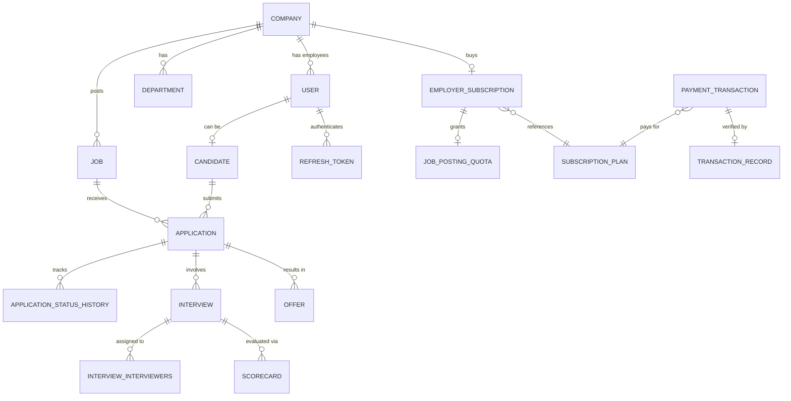
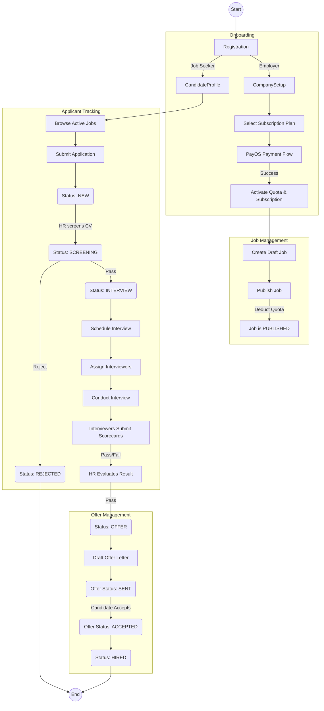

# VietRecruit — Application Flow Overview

## 1. Actor Roles
| Role | Description | Owned Entities | Key Permissions |
|---|---|---|---|
| **SYSTEM_ADMIN** | Global platform administrator | All configuration data | Full access to all modules, including billing and user management. |
| **COMPANY_ADMIN** | Account owner for a specific employer | `companies`, `departments`, `locations`, `employer_subscriptions`, `users` | Manage company profile, billing, plans, and invite HR/Interviewers. |
| **HR** | Primary recruitment operator | `jobs`, `applications`, `interviews`, `offers` | Create/edit jobs, manage applicant pipeline, schedule interviews, send offers. |
| **INTERVIEWER** | Technical/cultural assessor | `scorecards` | View assigned interviews, candidates, and submit scorecards. |
| **CANDIDATE** | Job seeker | `candidates`, own `users` profile, own `applications` | View jobs, apply, view own application status, and accept/decline offers. |
| **CUSTOMER_SERVICE** | Support staff | None directly owned | View transaction records for support purposes. |

## 2. Core Domain Model

## 3. End-to-End Application Flow

## 4. Module Interaction Map
- **Auth Module** orchestrates the generation of JWTs, OAuth state (`user_auth_providers`), and session state (`refresh_tokens`), acting as the gatekeeper for all functional modules.
- **Subscription & Payment Module** governs the **Job Module**. When `employer_subscriptions` expires or `job_posting_quotas` is exhausted, the Job Module must block `PUBLISHED` transitions.
- **Job Module** provides the context for the **Application Module**. Jobs hold AI embeddings (`vector`) used for candidate matching.
- **Application Module** acts as the parent context for the **Interview Module** and **Offer Module**. Transitions in these sub-modules (e.g., offer accepted) trigger state machine updates in `application_status_history`.

## 5. Data Lifecycle Summary
- **User / Company**: Soft deletion (`deleted_at`). Active flag toggles instead of hard removal.
- **Job**: `DRAFT` ➔ `PUBLISHED` (deducts quota) ➔ `CLOSED`. Soft deletion supported.
- **Application**: `NEW` ➔ `SCREENING` ➔ `INTERVIEW` ➔ `OFFER` ➔ `HIRED` | `REJECTED`. Traceability maintained via `application_status_history`.
- **Interview**: `SCHEDULED` ➔ `COMPLETED` | `CANCELED`.
- **Offer**: `DRAFT` ➔ `SENT` ➔ `ACCEPTED` | `DECLINED`.
- **Payment Transaction**: `PENDING` ➔ `PAID` | `FAILED` | `CANCELLED` | `EXPIRED`. Validated by append-only `transaction_records`.

## 6. Cross-Cutting Concerns
- **Auth Checkpoints**: Controlled strictly via `roles`, `permissions`, and `role_permissions` join tables based on the JWT claim.
- **Quota Enforcement**: Hard interlock. Publishing a job requires an active subscription and available `jobs_active` capacity in `job_posting_quotas`.
- **Payment Gates**: Asynchronous webhook validation. The platform provisions subscriptions only after a valid PayOS `transaction_records` entry is committed, hardening against false approvals.
- **Event Triggers / AI**: Inserts into `candidates` and `jobs` trigger `pgvector` indexing (`hnsw`) for resume parsing and vector search.
