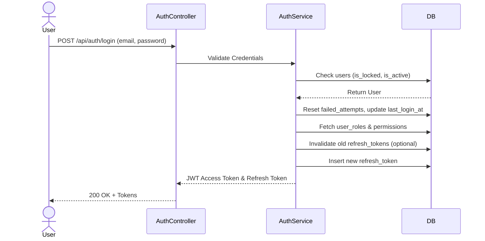
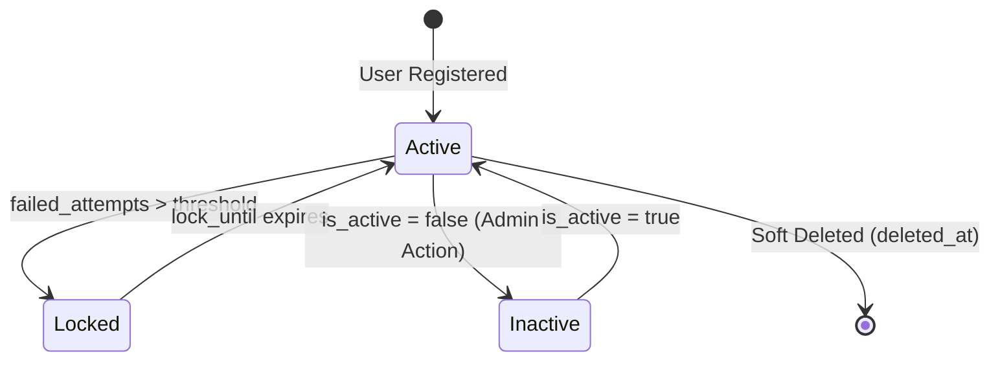

# Feature: AUTHENTICATION_AND_RBAC

## Overview
This feature handles user identity, multi-provider authentication (local and OAuth2), and granular Role-Based Access Control (RBAC). It ensures that system actors (System Admins, Employers, Candidates) are securely authenticated and authorized to access specific modules based strictly on their assigned permissions.

## Involved Tables
- **users**: Primary identity store including profile, state (active, locked) and security metrics.
- **user_auth_providers**: Maps external OAuth2 identities (e.g., Google, GitHub) to the core user record.
- **refresh_tokens**: Manages long-lived sessions securely and supports token revocation.
- **roles**: Defines the high-level actor profiles (SYSTEM_ADMIN, COMPANY_ADMIN, HR, INTERVIEWER, CANDIDATE, CUSTOMER_SERVICE).
- **permissions**: Granular functional access flags categorized by module (e.g., `JOB:CREATE`, `APPLICATION:MANAGE`).
- **role_permissions**: Junction table defining which roles possess which permissions.
- **user_roles**: Links users to their designated functional roles.

## Flow Diagram

## State Machine

## Business Rules
- **Account Lockout**: Implement security locks via `failed_attempts` and `lock_until` columns.
- **Session Revocation**: The `refresh_tokens.revoked` flag allows forcing users to log out across devices.
- **OAuth Linkage**: Enforced uniqueness on `(user_id, provider)` and `(provider, provider_user_id)` prevents conflicting OAuth links.
- **Token Hardening**: Store hashes (`token_hash`) instead of raw refresh tokens in the database to prevent theft.

## API Surface (inferred)
- `POST` `/api/v1/auth/login` (Public) — Authenticate via email/password.
- `POST` `/api/v1/auth/oauth/{provider}` (Public) — Authenticate via OAuth provider.
- `POST` `/api/v1/auth/refresh` (Public) — Renew access token using refresh token.
- `POST` `/api/v1/auth/logout` (Authenticated) — Revoke user's refresh token.
- `GET` `/api/v1/auth/me` (Authenticated) — Retrieve current user context and permissions.

## Edge Cases & Failure Points
- Attempting to authenticate a user whose `deleted_at` is safely populated or `is_active` is false.
- Handling OAuth emails that conflict with locally registered user emails without explicit user consent to link accounts.
- JWT secret rotation invalidating active sessions without clearing `refresh_tokens`.
