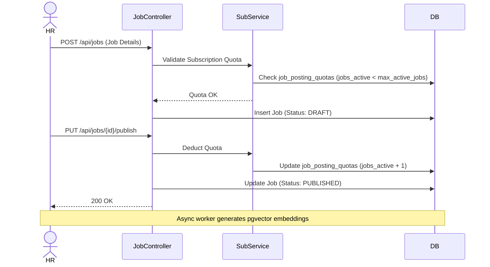
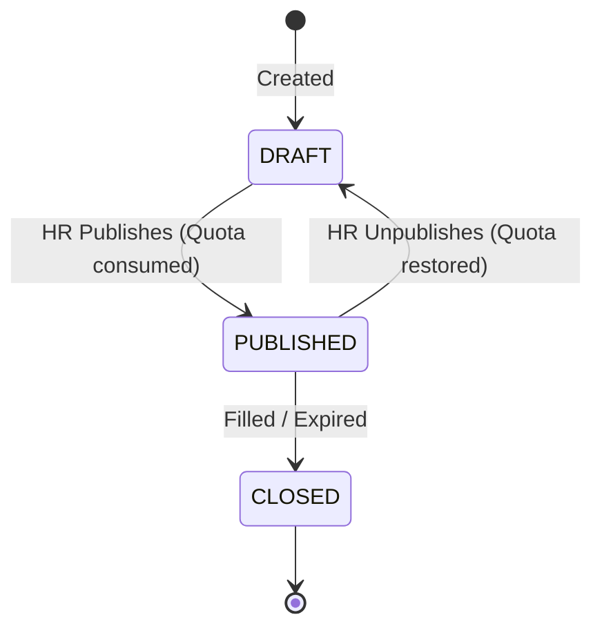

# Feature: JOB_POSTING

## Overview
This feature handles the creation, categorization, and publication of Job records by Employers. It acts as the gateway for candidate acquisition and serves as the core entity against which all downstream recruitment activities (applications, interviews, offers) are anchored.

## Involved Tables
- **jobs**: The central entity detailing the role requirements, salary, status, and AI matching vector.
- **departments**: Organizes jobs within an employer's internal corporate structure.
- **locations**: Specifies the physical or remote presence for the job role.
- **categories**: Industry or functional tagging (e.g., "Engineering", "Sales") used for search filtering.

## Flow Diagram

## State Machine

## Business Rules
- **Department/Location Security**: A job must only reference `department_id` and `location_id` that belong to the same `company_id` as the job itself.
- **Quota Lock**: Transitioning a job from `DRAFT` to `PUBLISHED` mandates a successful quota validation against the `employer_subscriptions` limits.
- **Soft Deletes**: `jobs.deleted_at` must be used. Hard deleting a job would cascade failure into the entire applicant tracking history.

## API Surface (inferred)
- `POST` `/api/v1/jobs` (HR) — Create a new job draft.
- `PUT` `/api/v1/jobs/{id}/publish` (HR) — Publish a job to the public portal.
- `GET` `/api/v1/jobs/public` (Public) — Search actively published jobs (with filters for location/category).
- `GET` `/api/v1/jobs` (HR) — List employer's jobs across all statuses.
- `PUT` `/api/v1/jobs/{id}/close` (HR) — Mark job as closed or filled.

## Edge Cases & Failure Points
- Quota race conditions where two HR members concurrently publish jobs, exceeding the `jobs_active` limit.
- `public_link` uniqueness collisions if duplicate vanity URLs are generated.
