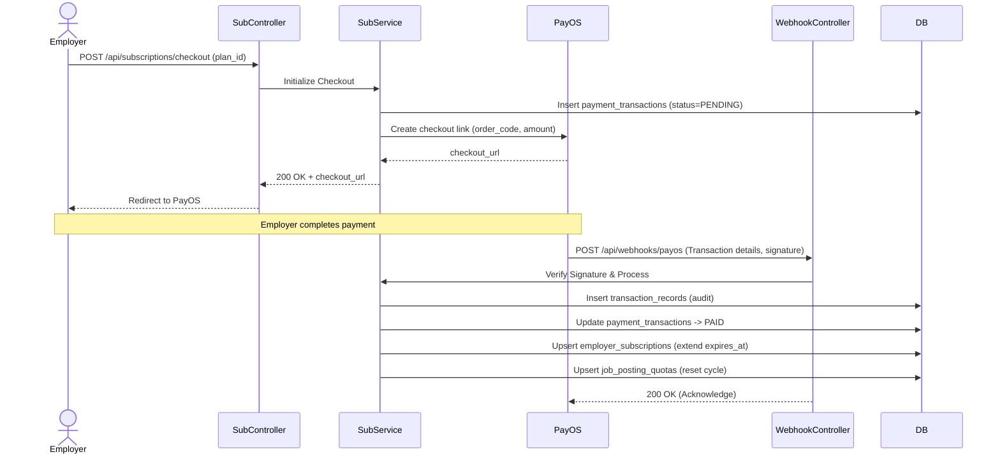
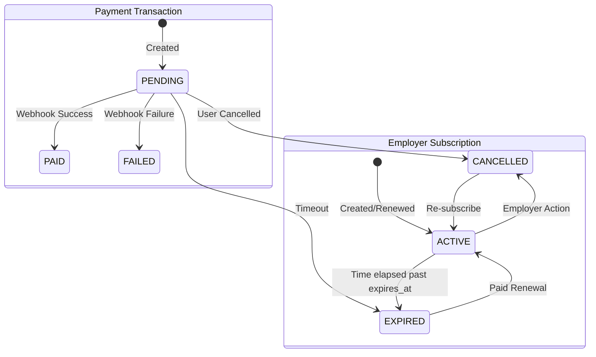

# Feature: SUBSCRIPTION_AND_PAYMENT

## Overview
This feature facilitates employer monetization via a tiered subscription model, enforced via job posting quotas. It integrates with PayOS for transaction processing, maintaining an airtight audit log of payment attempts and webhook-verified transaction records.

## Involved Tables
- **subscription_plans**: The catalog of available tiers (Free, Basic, Premium, Enterprise), dictating limits (`max_active_jobs`) and feature flags (`ai_matching`).
- **employer_subscriptions**: Joins a company to a plan, tracking active status, auto-renewal, cycle configuration, and expiration.
- **job_posting_quotas**: Enforces limits on concurrent active jobs vs. total jobs created within the billing span.
- **payment_transactions**: Tracks local checkout intent, amount, and state machine of the order.
- **transaction_records**: Append-only ledger verifying genuine PayOS webhook data against the origin transaction.

## Flow Diagram

## State Machine

## Business Rules
- **Idempotency**: Webhook processing must use `order_code` to prevent duplicate quota allocation if PayOS sends duplicate events.
- **Optimistic Locking**: `payment_transactions.version` implies optimistic locking to prevent race conditions during webhook ingestion and manual updates.
- **Concurrency Guard**: Schema enforces a unique partial index on `payment_transactions(company_id)` where `status = 'PENDING'`, meaning only one checkout can be in flight per company.
- **Single Active Subscription**: Enforced by unique index on `employer_subscriptions(company_id)` where `status = 'ACTIVE'`.

## API Surface (inferred)
- `GET` `/api/v1/plans` (Public/Auth) — List available subscription tiers.
- `POST` `/api/v1/payments/checkout` (Employer) — Initiate payment for a subscription plan.
- `GET` `/api/v1/payments/{orderCode}` (Employer) — Polling endpoint for payment status.
- `POST` `/api/v1/webhooks/payos` (Public - PayOS) — Webhook receiver for transaction finalization.
- `GET` `/api/v1/subscriptions/me` (Employer) — View current subscription and utilization quota.

## Edge Cases & Failure Points
- Failure in the PayOS webhook due to network partitions leaves the `payment_transactions` stuck in `PENDING`. Requires a synchronization cron job.
- Downgrades: Handling an employer downgrading their plan when their current active job count exceeds the new plan's `max_active_jobs`.
- Signature verification failures on the webhook endpoint represent critical security anomalies.
